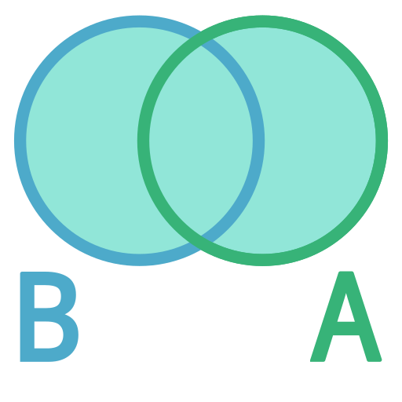

# Set  ⟷  Set Relation

 

## Equality

$Set_{ A} = Set_{ B}$

$Set_{ A} \subseteq Set_{ B}  \\&  Set_{ B} \supseteq Set_{ A}$

Every element of  <kbd>  SetA  </kbd>  is also part of  <kbd>  SetB  </kbd>  and vice versa.

 
 

## Proper Subset

$Set_{ A} \subset Set_{ B}$

$\lbrace 0 , 1 \rbrace \subset \lbrace 0 , 1 , 2 \rbrace$

<kbd>  SetA  </kbd>  is a subset of  <kbd>  SetB  </kbd>

Every element of  <kbd>  SetA  </kbd>  is also part of  <kbd>  SetB  </kbd>

 
 

## Improper Subset

$Set_{ A} \subseteq Set_{ B}$

$\lbrace 0 , 1 \rbrace \subseteq \lbrace 0 , 1 \rbrace$

$\lbrace \rbrace \subseteq \lbrace 0 , 1 \rbrace$

<kbd>  SetA  </kbd>  is a proper subset of  <kbd>  SetB  </kbd>

<kbd>  SetA  </kbd>  may be equal to  <kbd>  SetB  </kbd>

Every element of  <kbd>  SetA  </kbd>  is also part of  <kbd>  SetB  </kbd>

 
 

## Extended

| Subset | Positive | Negative |
|:------:|:--------:|:--------:|
| Improper | `⊆` | `⊈`
| Proper   | `⊂` | `⊄`

| Superset | Positive | Negative |
|:--------:|:--------:|:--------:|
| Improper | `⊇` | `⊉`
| Proper   | `⊃` | `⊅`

 
 

## Union

 
 

## Intersection

 
 

## Difference

 
 

 
